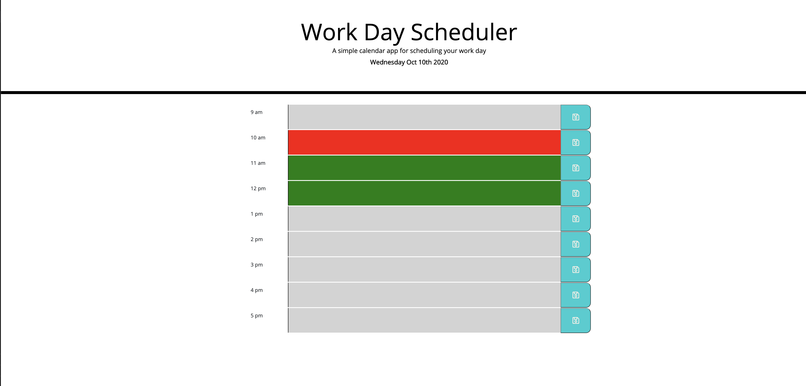

# work-day-scheduler

In this project, I have built a functional day time planner, from 9am to 5pm. When opening you will notice the current date on top of the page. 
When you scroll down you will be presented with time blocks for standard business hours. When you view each time block, each will be color coated based on whether is is past, present, or future. When you click on the save button for that time block then the text will be saved into local storage. 

## Installation of Repo

Follow these steps to view my project!

1. Open link in github. - https://github.com/xdanielmtz/work-day-scheduler
2. Clone with SSH
3. Run "git clone" command in Terminal with the pasted link
4. Run "code ." command to open in VS Code.
5. Enjoy.

## What will you find in this repo?

- An index.html (The web application itself)
- CSS sheet 
- Javascript page
- A readme.

## Deployed Site Link:
(Work Day Scheduler) https://xdanielmtz.github.io/work-day-scheduler/

## Sneak Peak:
 